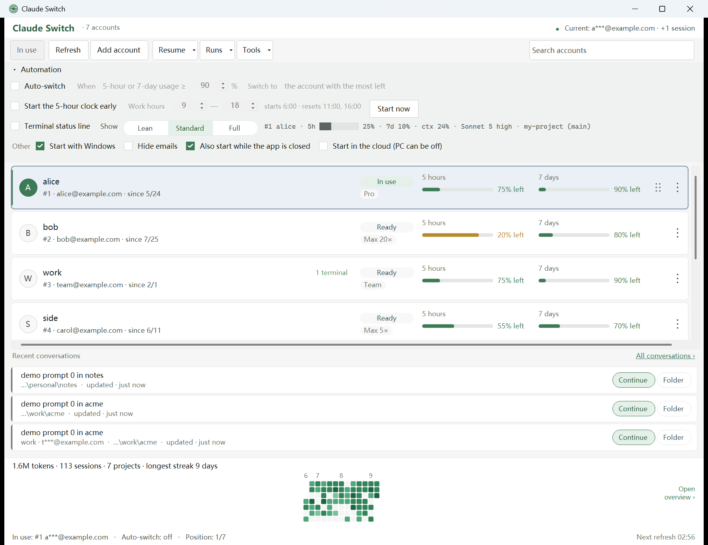

<p align="center">
  
</p>

<h1 align="center">Claude Switch</h1>

<p align="center">
  A Windows tray app for switching between Claude Code accounts.<br>
  <b>When a rate limit is hit, it switches for you — no Claude Code restart, and the session in progress keeps going.</b>
</p>

<p align="center">
  <a href="https://github.com/nimeia/claude_switch/releases/latest"></a>
  <a href="https://github.com/nimeia/claude_switch/actions/workflows/ci.yml"></a>
  
  <a href="LICENSE"></a>
</p>

<p align="center">
  <a href="https://github.com/nimeia/claude_switch/releases/latest"><b>Download</b></a> ·
  <a href="https://nimeia.github.io/claude_switch/">Website</a> ·
  <a href="https://nimeia.github.io/claude_switch/zh/">简体中文介绍</a>
</p>

<picture>
  <source media="(prefers-color-scheme: dark)" srcset="site/assets/img/app-main-dark.png">
  
</picture>

<p align="center"><sub>Demo data from the app's own <code>--fixture</code> mode.</sub></p>

## Install

Download from [Releases](../../releases). Either option is the same build:

| Download | Best for |
|---|---|
| `ClaudeSwitch-<version>-win-x64.zip` | **Recommended.** Unzip and run; includes quick-start notes and license. Browsers warn less on zip than on bare exe |
| `ClaudeSwitch-<version>-win-x64.exe` | Just the program |

No .NET install. No Rust install.

**There is no installer** — it is a portable executable: no registry writes, no admin rights, put it anywhere, delete it to uninstall. Launch-at-login is controlled by a checkbox in the app (current-user Startup shortcut; uncheck to remove).

The one exception: the .NET single-file bundle extracts its runtime on first launch to `%TEMP%\.net\ClaudeSwitch\`. That is normal .NET behavior, not an install.

**Windows SmartScreen will warn on first run** — this program is not code-signed (a cert costs hundreds of dollars a year; we have not bought one yet). Click **More info** → **Run anyway**.

Files extracted from the zip also carry the Mark of the Web, so **the zip does not bypass that prompt**.

If you want to double-check the download, Releases include SHA256 checksums:

```powershell
Get-FileHash ClaudeSwitch.exe -Algorithm SHA256
```

Or [build from source](#build-from-source) — the steps are the same ones CI uses.

## What problem it solves

You have several Claude accounts (personal + work, or multiple subscriptions). Mid-session the 5-hour limit hits and Claude Code stops. You export credentials, swap files, restart.

This tool turns that into: **it switches; you keep writing.**

- **Switches take effect on the running session** — on Windows credentials are files; Claude Code re-reads them on change, so the next message uses the new account. No restart, no reopening VS Code tabs.
- **Auto-switch** — when any account’s 5-hour or 7-day usage reaches the threshold, it moves to the healthiest available account. It also fails over when the current account is **broken** (login dead, subscription gone, empty slot) — cases a threshold alone would never catch.
- **Usage at a glance** — per-account 5-hour / 7-day headroom, plan (Pro / Max 20× / Team), subscription start date.
- **Usage overview** — what you actually did in Claude Code: total tokens, activity calendar, project breakdown.

## Features

### Accounts

- Capture the machine’s current login (**Add account**); multi-slot, aliases, drag reorder, disable
- **The active account is resolved from the live login**, not replayed from the last switch this app made — `claude /login` or other tools are recognized correctly
- Plan info is read from each slot’s own credentials + `.claude.json` backup — **no network request**. Renewal dates are not shown: OAuth tokens have no billing scope, so that date is unavailable

### Usage

- Fetched per slot; expired OAuth tokens are refreshed first (**the currently logged-in account’s token is never rotated** — that would kick your live session)
- When usage cannot be loaded, the reason is explicit (`Needs login` / `No credentials` / `No subscription quota` / `API Key` / `Fetch failed`) instead of a blank

### Auto-switch

- **Only switches to accounts with measured usage.** Unmeasured slots are skipped and never ranked as “0% used / 100% free” — otherwise the one account that cannot work would rank first
- Failover wait policy depends on whether waiting can help: wiped login fails over immediately; transient network faults wait for `unhealthyTicks`
- Credentials without an access token **refuse activation**, including manual switch — that is not a switch, it is a logout

### Parallel sessions

**Use different accounts in different terminals at the same time.** Right-click a card → **Open terminal with this account**, pick a directory, and a new terminal runs Claude Code logged into that account — **the default login, other terminals, and the VS Code extension are unaffected**.

Each account gets its own config directory (`<backup root>/sessions/<slot>-<email>/`), pointed at with `CLAUDE_CONFIG_DIR` on launch. Claude Code resolves config and credentials through that variable, so isolation is complete.

- **Directories can be bound to an account** — in the **Directories** window, right-click → **Bind to account**. Opens from **Resume session** or **Directories** then use that account automatically. Subdirectories inherit the nearest bound ancestor
- **Your own config is shared**: `settings.json` / `CLAUDE.md` / `skills/` / `commands/` / `agents/` and user-level MCP servers are re-synced from `~/.claude` on every session start. Edits inside the session profile are overwritten next launch — change them in `~/.claude`
- **Transcript history is not copied** (copying would fork). **Directories**, usage overview, and **Resume session** scan every session profile and **merge** results, so work done under any account is visible and each directory appears once
- **Auto-switch skips accounts that already have a live terminal** — their quota is already being spent, and promoting them to the default login would put the same refresh token in two config dirs
- If the target account **is already the default login**, a bare `claude` is started with no second credentials copy
- Deleting an account removes its session profile and directory bindings; deletion is refused while a terminal is still running

### Terminal app

**Tools → Terminal…** picks which application opens when this tool starts Claude Code (Open terminal, Resume session, Directories). Supervised runs stay inside Claude Switch.

- **Automatic** (default) uses **Windows Terminal** when `wt.exe` is present, otherwise a direct spawn of `claude.exe`
- **Warp** is listed first among terminals built for coding agents. Env and `claude --resume` are written to a `.cmd` file; Warp only types `cmd.exe /c` that file (its default shell is PowerShell, which cannot parse `"claude.EXE" --resume`)
- Also: WezTerm, Ghostty, Alacritty, Tabby, ConEmu/Cmder, Windows Console Host, or the system default console
- Uninstalled apps are shown but not selectable. A named choice that fails to start is reported, not silently replaced

### Proxy and region

Some accounts only work through one proxy node, and Claude Code shows times in the zone it is told, not the Windows one. Right-click a card → **Proxy & region…** sets both, per account.

- **Proxy**: System (the app proxy, else the machine's), a custom HTTP URL, or Direct. Terminals and agents opened as that account get it in their environment, and it goes into the account's `settings.json` `env` so Claude Code's background workers match
- **Timezone and language** become `timeZone` / `language` in the same `settings.json`, plus `TZ` / `LANG` for processes this app starts. **Detect from exit** probes the proxy's exit IP and fills them in; there are also presets and a custom value. **Follow the system** removes the keys, so another account's region cannot stick
- When that account is the default login, the same keys go into `~/.claude/settings.json`, so a `claude` you start yourself sees them. Windows already open pick changes up only after you reopen them
- **Tools → App proxy…** sets the proxy for this app's own requests (usage refresh, exit-IP detection) and for every account left on System

### Directories and sessions

- The toolbar **Resume session** dropdown and the tray menu list recent sessions per directory — **one step back into the last conversation**
- The **Directories** window browses every directory and its full session list
- Resume opens Claude Code in the app chosen under **Tools → Terminal…**. **Automatic** uses Windows Terminal when it is installed; Warp, WezTerm, Ghostty, Alacritty, Tabby, ConEmu/Cmder, Console Host, or the system default console can be selected instead
- Aggregate token stats run on demand (reads all transcripts, typically a few hundred ms) with visualization
- **Directories themselves are account-agnostic** — Claude Code does not record which account owned a conversation. The **Account** column is the binding you set for that directory (which account opens from there), not something read from the transcript

### Terminal status line

A line at the bottom of every Claude Code terminal, answering what Claude Code's own status line cannot: **which account this terminal is on, and how much of its quota is left.**

```
#2 work · 5h ████░░░░░░ 38% · 7d 12% · ctx 24% · Sonnet 5 high · my-project (main)
5h resets 14:30 · 7d resets Fri 09:00 · spare #3 ops 8% · auto 90% · $1.24 42m
```

- **Three presets, no widget editor** — Lean / Standard / Full, from a checkbox in **Automation**. The settings row previews the real line, rendered by the same code that draws it in the terminal
- **It uses the width you have** — Full is one line on a terminal wide enough to hold it, and only breaks in two when it is not. Pass `--width <cols>` (or `--width 0` to keep the break) if your terminal cannot be asked
- **Model, thinking effort, context, cost** come from Claude Code's own payload; the account, the windows and the spare come from this app
- **Per terminal, not per machine** — a terminal opened for one account names *that* account, not the default login
- **No Node, no runtime** — a ~750 KB native binary, written to `~/.claude-swap-backup/bin/` when you turn the feature on. No network, no `git` subprocess: it reads three local files and exits
- **Your own `settings.json` is respected** — the `statusLine` key is merged in, everything else is kept, and a file that does not parse is left untouched. If another status line (e.g. ccstatusline) is configured, it is never replaced without asking, and turning this off puts it back
- Enabling it once covers every per-account terminal: session profiles re-sync `~/.claude/settings.json` on launch

Details and the data sources are in [docs/statusline.md](docs/statusline.md).

### UI language

English / Simplified Chinese via the language button on the right of the toolbar — **no restart**. Main window, cards, and status bar update immediately; other windows pick it up the next time they open. First launch follows the system language; after you pick one, that choice is remembered.

For a one-off override: `CLAUDE_SWITCH_LANG=en` (takes priority over the remembered choice).

<details>
<summary>Want to add a language?</summary>

Copy `gui-win/ClaudeSwitch.App/Strings/en.json` to your language code (e.g. `ja.json`), translate the values, and add a row in `Loc.Available`. Catalogs are embedded resources — no build-script changes.

`LocTests` requires every catalog to match English **keys exactly** and `{0}` placeholders exactly — a missing string or wrong placeholder fails the test instead of shipping half-English UI.

Practical note: **English is often 1.5–2× wider than Chinese**. This project already widened the toolbar, card meters, subscription columns, and heatmap legend for that. Render the UI when you add a language; do not judge from the JSON alone.
</details>

## Networking

Requests honor `HTTPS_PROXY` / `ALL_PROXY` / `NO_PROXY`, and on Windows also read the system proxy settings — the same path Claude Code uses. **Tools → App proxy…** overrides that for this app and for accounts set to System; an account can also have its own (see [Proxy and region](#proxy-and-region)).

> If your network can only reach Anthropic through a proxy, a direct connection returns `403 "Request not allowed"`. That error **looks like auth failure but is network reachability**. Environment variables are read at startup, so restart after changing them; a proxy set in the app applies to its own requests right away.

## Where data lives

| Location | Contents |
|---|---|
| `~/.claude-swap-backup/credentials/` | Per-slot credentials (encrypted) |
| `~/.claude-swap-backup/configs/` | Per-slot `.claude.json` snapshots |
| `~/.claude-swap-backup/sequence.json` | Slot order, current account, and each account's proxy & region |
| `~/.claude-swap-backup/settings.json` | App settings: auto-switch, warmup, status line, app proxy |
| `~/.claude-swap-backup/sessions/` | Per-account session profiles (including their own transcript history) |
| `~/.claude-swap-backup/mappings.json` | Directory → account bindings (machine-local) |
| `~/.claude-swap-backup/cache/` | Usage-overview cache (safe to delete) |
| `~/.claude-swap-backup/bin/` | The status-line renderer, written when that feature is enabled |
| `~/.claude-swap-backup/statusline.json` | What the status line reads (no credentials) |
| `~/.claude/settings.json` | Claude Code's own file. Only these keys are ever written: `statusLine` (a copy of the file is kept as `settings.json.cswitch-bak`), `cleanupPeriodDays` (history retention), and for the default login's proxy & region `timeZone`, `language` and the proxy / `TZ` / `LANG` entries under `env`. Everything else is kept |
| `%LOCALAPPDATA%\ClaudeSwitch\ui-prefs.ini` | UI prefs (theme, language, hide email, etc.) |
| `%TEMP%\.net\ClaudeSwitch\` | Self-extracted single-file runtime |

Layout is compatible with [claude-swap](https://github.com/realiti4/claude-swap) (Python CLI); both can share the same backup tree. Session profile layout matches its `cswap run` layout; only internal marker filenames differ (`.cswitch-*` vs `.cswap-*`) — both can read the same profiles, each managing its own markers.

### Move Claude data to another drive

`~/.claude` grows with every transcript. **Tools → Move Claude data…** moves it, and `~/.claude-swap-backup`, to another drive without changing Windows user folders or `CLAUDE_CONFIG_DIR`. The data is copied to `<folder>\claude` and `<folder>\swap`, and the original paths become directory junctions pointing there, so Claude Code, the VS Code extension and this app keep using the same paths.

- **Close Claude Code first.** The move is refused while a session is running, and checked again after the copy. Then the originals are renamed aside (Windows refuses that while any program has a file open inside), whatever changed during the copy is copied again, and the links are made. If any step fails, both folders are put back — they never end up half-moved
- **Links inside `~/.claude`** — say `commands/` or `CLAUDE.md` linked from a dotfiles repo — are recreated at the new location, not copied and not dropped
- **The destination** must be an empty folder, or one this app filled before (recorded in `.claude-switch-relocate.json` there), on a fixed NTFS drive: a USB or network drive can go away and take Claude Code's data with it. The new `claude\` and `swap\` get the same access as your user folder — you, SYSTEM and Administrators
- The originals stay as `~/.claude.reloc-backup` and `~/.claude-swap-backup.reloc-backup` until you click **Delete C: backups**
- **Undo** copies the current data back — including everything that changed since the move — and then removes the links. It still works after the backups are deleted. The copy left on the other drive is named so you can delete it
- `~/.claude.json` stays in your user folder; it is small

### Uninstall Claude Code

**Tools → Remove Claude Code…** deletes the Claude Code program and the files it wrote while running (`~/.claude`, `~/.claude.json`, the native installer under `~/.local`, `claude-cli-nodejs` cache, and so on). It is not the same as deleting one managed account.

Imported accounts are a separate choice: keep `~/.claude-swap-backup` so a later reinstall can switch back into those logins, or delete that tree too. The Claude desktop app, this program, and committed `CLAUDE.md` files in your repos are left alone unless you tick the matching optional boxes.

## Build from source

Requires Rust 1.80+ and the .NET 8 SDK.

```bash
cargo build -p claude-switch-ffi --release
dotnet publish gui-win/ClaudeSwitch.App/ClaudeSwitch.App.csproj \
  -c Release -p:PublishSingleFileBundle=true -o dist
```

Output is a single `dist/ClaudeSwitch.exe`. Order matters — the native engine must be built first, or publish fails hard instead of shipping a binary that dies on launch.

To produce the same artifacts as a Release (exe + zip + checksums):

```powershell
./packaging/pack.ps1 -PublishDir dist -OutDir artifacts
```

For development:

```bash
cargo test --workspace
dotnet test gui-win/ClaudeSwitch.App.Tests/ClaudeSwitch.App.Tests.csproj
dotnet run --project gui-win/ClaudeSwitch.App -c Release -- --fixture %TEMP%\cswitch-demo
```

`--fixture` starts with isolated demo data (six accounts across plan types) and does not touch your real Claude login.

## Project layout

```
crates/core     claude-switch-core   locks, credentials, switch, usage, autoswitch, session mode, Engine
crates/ffi      claude_switch.dll    C ABI (cs_engine_*)
crates/statusline cs-statusline.exe  the status line Claude Code runs on every repaint
gui-win/        Windows tray GUI (WinForms) + FfiSmoke + P/Invoke
gui-win/ClaudeSwitch.App/Strings/    UI catalogs (one JSON per language, embedded)
site/           the product page: one static HTML file + app screenshots (GitHub Pages)
tools/site/     builds what Pages publishes (/zh/ page, sitemap)
tools/promo/    walk-through for announcing a release on X, Facebook and Reddit (posts, images)
```

- [docs/design-claude-switch.md](docs/design-claude-switch.md) — architecture, FFI, UI design
- Behavior is specified by the upstream Python CLI [claude-swap](https://github.com/realiti4/claude-swap) — credentials, three-lock switch transactions, autoswitch, and poll policy follow it.
  For development you can clone it to `reference/claude-swap/` (that path is not version-controlled).

Version is the root `VERSION` file and must match `Cargo.toml` `[workspace.package].version`.

## CI and release

Every push / PR runs a full Windows gate: Rust (fmt / clippy / test) → GUI tests → single-file publish → package (exe + zip + SHA256) → launch smoke. Artifacts are kept as workflow artifacts for 14 days.

The product page is separate: [pages](.github/workflows/pages.yml) publishes `site/` to https://nimeia.github.io/claude_switch/ when a push to master changes it. Setup and details are in [site/README.md](site/README.md#publishing).

**A release is a version bump that reached master.** Bump `VERSION` and the matching `Cargo.toml` `[workspace.package].version`, commit, merge. Once the gate passes, CI asks whether that version already has a tag; if it does not, it calls the [release](.github/workflows/release.yml) workflow, which rebuilds, smokes, creates `v<VERSION>` and publishes a GitHub Release with `ClaudeSwitch-<version>-win-x64.zip` / `.exe` / `SHA256SUMS.txt`.

The gate is **the absence of the tag**, not the diff of the push — a rerun, a squash, a revert or a force push all converge on one release per version, which a diff-based check does not.

Pushing a `v*` tag by hand still does the same thing, for a release cut off-schedule:

```powershell
git tag v0.2.0    # tag without the leading v must equal VERSION
git push origin v0.2.0
```

CI calls the release workflow instead of pushing a tag itself, because a tag pushed with `GITHUB_TOKEN` does not start another workflow — the release would build nothing.

Dry run (no publish): Actions → **release** → Run workflow, leave `dry_run=true`. That builds and packages the artifacts without creating a Release.

## Platforms

Windows only for now. The core is cross-platform Rust; macOS / Linux native shells are in the design doc but not built yet.

## License

MIT — see [LICENSE](LICENSE). Backup format stays interoperable with claude-swap.

An independent, community-built tool. Not affiliated with, sponsored by, or endorsed by Anthropic. “Claude” and “Claude Code” are Anthropic's trademarks, used here only to say what this tool works with.
